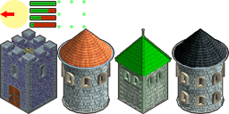

# Tower Game Starter Kit - Adding A Custom Tower

This is my modified source code for the Tower Game Starter Kit ([wootstudio.ca/towergamekit](wootstudio.ca/towergamekit)) that includes a custom tower type.

## Steps

### Draw new tower

- Edit `game-media\entities.png` & draw new tower
- New tower should by 64x96 and replace the  at the bottom of the image
 
- That tower on the bottom is my new tower, I'm not very creative so I just edited the 2nd tower to make it more epic

### Draw new build menu

- Edit `game-media\buildmenu.png` & draw new tower build option
- You'll notice it was designed for 3 towers
- We'll need to update the build menu code accordingly (see *Update Build menu*)

### Update build menu
- Next we need to edit the code to (a) understand the new menu layout & (b) support our new tower type
- In `TowerGameStarterKit.js:295` add a fourth `buildChoice4tileX` &Aacute; `buildChoice4tileY` (This gives a default offscreen position for the tile)
			var buildChoice4tileY = FAR_AWAY;

- In `TowerGameStarterKit.js:306` add a fourth `buildMenuOverlay` (These overlays are used to disable towers that you can't afford to build)

			var buildMenuOverlay4 = null;

- In `TowerGameStarterKit.js:2808` initialize the fourth `buildMenuOverlay`

			buildMenuOverlay4 = extractSprite(jaws.assets.get("gui.png"), 272, 464, 50, 50, {
			    anchor: "center_bottom"
			});

- In `TowerGameStarterKit.js:2816` store the new sprite into the `game_objects` SpriteList
	
	game_objects.push(buildMenuOverlay4);

- In `TowerGameStarterKit.js:2830` create a clickable button (yellow highlight) 
	
			buttonHighlight[3] = new jaws.Sprite({
                    image: buttonHighlightImageON,
			        anchor: "center_bottom"
			    });

- In `TowerGameStarterKit.js:2840` store the new button sprite into the `game_objects` SpriteList
	
	game_objects.push(buildMenuOverlay4);
	
- In `TowerGameStarterKit.js:2792` initialize the fourth overlay

			fundingPercent = player_Gold / buildCost[3];
			if (fundingPercent >= 1) {
				fundingPercent = 1;
				buttonHighlight[3].setImage(buttonHighlightImageON);
			} else {
				buttonHighlight[3].setImage(buttonHighlightImageOFF);
			}
			buildMenuOverlay4.setHeight(buildMenuOverlayHeight - (buildMenuOverlayHeight * fundingPercent));

- Since we've altered the layout of the menu (from round to a recntangle) we'll next edit the `buildMenuMove` function at `TowerGameStarterKit.js:2713`

	    buildMenuOverlay4.moveTo(px, py + 40);
	    buttonHighlight[3].moveTo(px, py + 80 + 16);

- Next we make sure to hide the new (fourth) build menu option at `TowerGameStarterKit.js:2737`

			buildChoice4tileX = FAR_AWAY;
			buildChoice4tileY = FAR_AWAY;

- Edit add the new tower tile (replaces the X)

				buildChoice4tileX = tileX;
				buildChoice4tileY = tileY + 1;

- Update the tile click handler to understand the new tile (aka the new tower)

			if (tileX == buildChoice4tileX && tileY == buildChoice4tileY) {
			    selectedBuildingStyle = 3;
			}

- Fix the hack check
	
		if (selectedBuildingStyle > 3)

### Register tower image

- In `TowerGameStarterKit.js:2543` you'll find the code that chops up the `entities.png` file into individual images.
- `chopImage` takes as parameters
	- the asset (in our case `jaws.assets.get("entities.png")`)
	- the starting X coordinate
	- the starting Y coordinate
	- the width
	- the height
- To add out image we would insert the following line of code
	
			towerImages[4] = chopImage(jaws.assets.get("entities.png"), 192, 32, 64, 96);

### How much is that tower in the window?

- Next step is to give your awesomesauce new tower a price
- In `TowerGameStarterKit.js:279` you'll an array named `buildCost` with three elements, add a forth to represent the cost of your tower like so
		
			var buildCost = [15, 25, 32, 35];

### Set the towers weapon info

- First we record a constant for the new tower weapon type in `TowerGameStarterKit.js:414`

		var WEAPON_FIRE_PLUS = 4;

- In `TowerGameStarterKit.js:419` you'll find the function `GameWeapon(style)` which takes an style (offset) and returns the weapon info. We'll just use the existing info for the fire tower and make it fire faster see `this.shootDelay`

			case WEAPON_FIRE_PLUS:
				this.projectilenumber = particleFIRE;
				this.damage = 40; // three hit to kill
				this.damagetype = DAMAGETYPE_MAGICAL;
				this.particleHit = particleFIREHIT;
				this.soundEffectName = 'shootFire';
				this.shootDelay = 1500; // twice as fast as WEAPON_FIRE
				break;
 