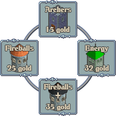

# Tower Game Starter Kit - Adding A Custom Tower

This is my modified source code for the Tower Game Starter Kit ([wootstudio.ca/towergamekit](wootstudio.ca/towergamekit)) that includes a custom tower type.

## Steps

### Draw new tower

- Edit `game-media\entities.png` & draw new tower (64x96 pixels), you will need to make the image 64 pixels wider.

	

- Since I'm not an artist, I simply copied and modified the Fireball tower :)
 
### Draw new build menu
- `game-media\buildmenu.png` contains the image that is used when the build menu is shown.
- We'll edit this to include our new tower by simply replacing the 'X' that would normally be at the bottom
- Since you can click anywhere outside of the tower tiles to close the menu I figured this was an acceptable trade off

	

### Update build menu
- Next we need to edit the code to
	- understand the new layout
	- support our new tower type
- In `TowerGameStarterKit.js:295` add a fourth `buildChoice4tileX` &Aacute; `buildChoice4tileY`, this gives a default position for the tile

			var buildChoice4tileX = FAR_AWAY;
			var buildChoice4tileY = FAR_AWAY;

- In `TowerGameStarterKit.js:306` add a fourth `buildMenuOverlay`, these semi transparent gray overlays are used to visually indicate how much longer until you can afford the tower

			var buildMenuOverlay4 = null;

- In `TowerGameStarterKit.js:2808` initialize the fourth `buildMenuOverlay`, this extracts the image (gray 50x50 transparent overlay) in `gui.png` found at 272,464

			buildMenuOverlay4 = extractSprite(jaws.assets.get("gui.png"), 272, 464, 50, 50, {
			    anchor: "center_bottom"
			});

- In `TowerGameStarterKit.js:2816` store the new sprite into the `game_objects` [SpriteList](http://jawsjs.com/docs/symbols/jaws.SpriteList.html)
	
	game_objects.push(buildMenuOverlay4);

- In `TowerGameStarterKit.js:2830` create the sprite used to indicate the tower can be purchased (the yellow highlight that's placed around the tower tile)
	
			buttonHighlight[3] = new jaws.Sprite({
                    image: buttonHighlightImageON,
			        anchor: "center_bottom"
			    });

- In `TowerGameStarterKit.js:2840` store the new button sprite into the `game_objects` [SpriteList](http://jawsjs.com/docs/symbols/jaws.SpriteList.html)
	
	game_objects.push(buildMenuOverlay4);
	
- In `TowerGameStarterKit.js:2792` initialize the fourth overlay. This code checks to see if you can afford the tower.
	- If you can afford the tower the buttonHighlightImageON (aka yellow highlight frame) is shown
	- If you can't afford the tower, the overlay (that semi transparent gray tile) is placed over the tower showing how much longer (percent) until you can afford the tower

				fundingPercent = player_Gold / buildCost[3];
				if (fundingPercent >= 1) {
					fundingPercent = 1;
					buttonHighlight[3].setImage(buttonHighlightImageON);
				} else {
					buttonHighlight[3].setImage(buttonHighlightImageOFF);
				}
				buildMenuOverlay4.setHeight(buildMenuOverlayHeight - (buildMenuOverlayHeight * fundingPercent));

- `TowerGameStarterKit.js:2713` we now we place the overlay and highlight sprites over our new tower tile 

	    buildMenuOverlay4.moveTo(px, py + 40);
	    buttonHighlight[3].moveTo(px, py + 80 + 16);

- Next we make sure to hide the new tile menu when `buildMenuOFF()` is called, at `TowerGameStarterKit.js:2737`

			buildChoice4tileX = FAR_AWAY;
			buildChoice4tileY = FAR_AWAY;

- All interactions (clicks/taps) in the game are done on a virtual tile grid, so we need to define the coordinates (X,Y) for the tile that will represent our new tower when the build menu is shown and the user clicks/taps in the game which triggers `clickTile(tileX, tileY)`
- We'll add this code in `TowerGameStarterKit.js:2880`

			buildChoice4tileX = tileX;
			buildChoice4tileY = tileY + 1;

- Further down in the `clickTile` function we'll check to see if our new tower was clicked on `TowerGameStarterKit.js:2912`

			if (tileX == buildChoice4tileX && tileY == buildChoice4tileY) {
			    selectedBuildingStyle = 3;
			}

- I'll be honest, I'm not sure yet exactly what this code does, but it does seem to check to see if we are past the number of towers, so I've updated `TowerGameStarterKit.js:2950` like so
	
		if (selectedBuildingStyle > 3)

### Register tower image

- In `TowerGameStarterKit.js:2543` you'll find the code that chops up the `entities.png` file into individual images.
- `chopImage` takes as parameters
	- `image`: the asset (in our case `jaws.assets.get("entities.png")`)
	- `x`: the starting X coordinate
	- `y`: the starting Y coordinate
	- `width`: the width to chop (x + width)
	- `height`: the height tp chop (y + height)
- To add our image we would insert the following line of code
	
			towerImages[4] = chopImage(jaws.assets.get("entities.png"), 192, 32, 64, 96);

### How much is that tower in the window?

- Next step is to give your awesome new tower a price
- In `TowerGameStarterKit.js:279` you'll find an array named `buildCost` with three elements, add a forth to represent the cost of your tower
		
			var buildCost = [15, 25, 32, 35];

- Why 35? Your cost could be anything, but I didn't have the font file used, so I cut out a 3 and a 5 from the other towers and used that for my new tower ;)

### Set the towers weapon info

- First we record a constant for the new tower weapon type in `TowerGameStarterKit.js:414`

		var WEAPON_FIRE_PLUS = 4;

- In `TowerGameStarterKit.js:419` you'll find the function `GameWeapon(style)` which takes an style (offset) and returns the weapon info. We'll just use the existing info for `WEAPON_FIRE` and make it fire faster by adding `this.shootDelay` with a shorter time in milliseconds

			case WEAPON_FIRE_PLUS:
				this.projectilenumber = particleFIRE;
				this.damage = 40; // three hit to kill
				this.damagetype = DAMAGETYPE_MAGICAL;
				this.particleHit = particleFIREHIT;
				this.soundEffectName = 'shootFire';
				this.shootDelay = 1500; // twice as fast as WEAPON_FIRE
				break;

## That's It!

That's about it, you should be able to run your game and select your new tower and kill those pesky peasants!